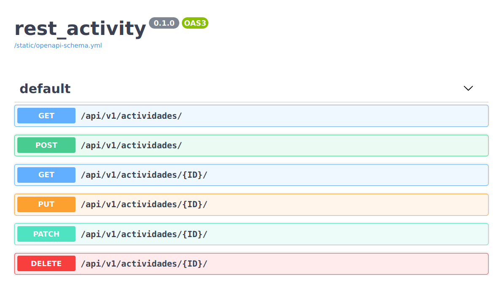
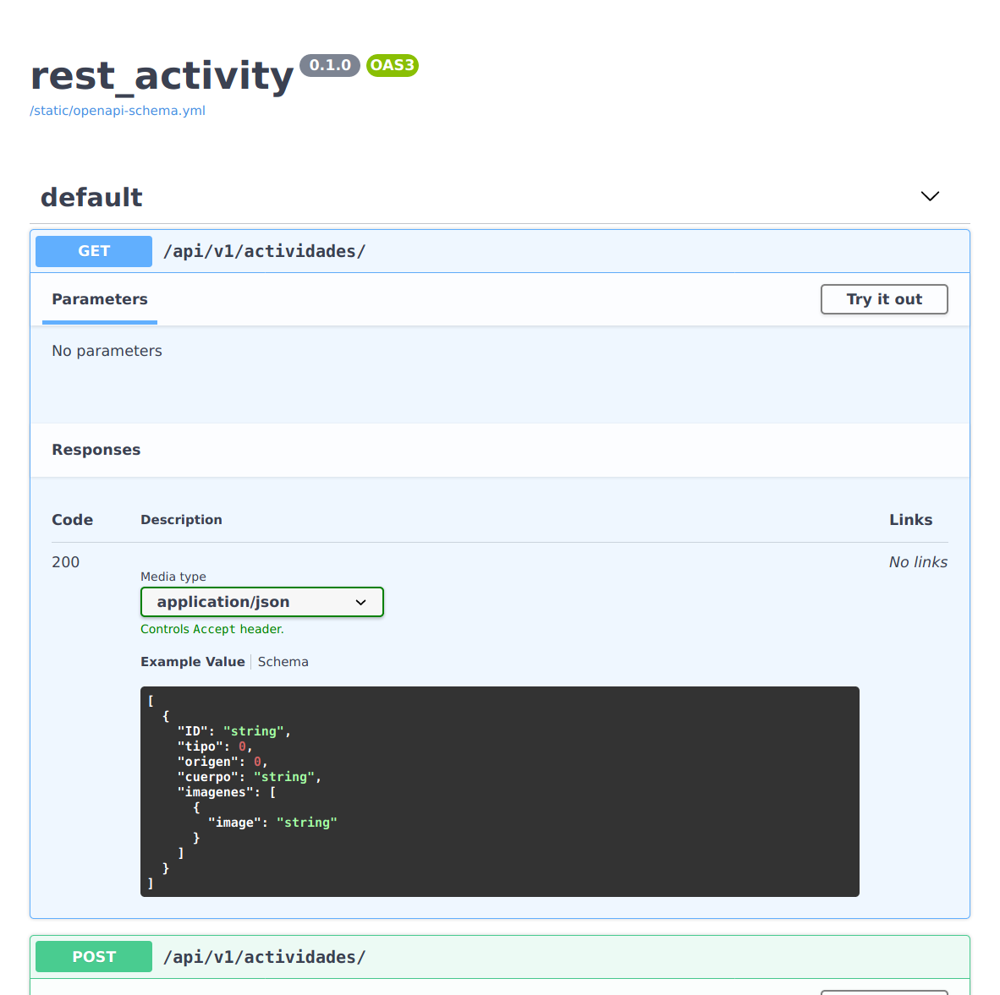

# rest_activity
A simple activity list REST API

## Requirements

- Python 3.6+
- Django 2.2+

## Install

```
git clone git@github.com:melizeche/rest_activity.git
cd rest_activity
python3 -m venv env
source env/bin/activate
pip install -r requirements.txt
./manage.py migrate
./manage.py runserver
```

## API Docs
 Check  openapi-schema.yml or go to `/docs/` 
 
 

## Backlog

[Product Backlog](backlog.md)

## Author

- Marcelo Elizeche Landó https://github.com/melizeche


## License

This project is licensed under the terms of the MIT Public License - see the [LICENSE](LICENSE) file for details
